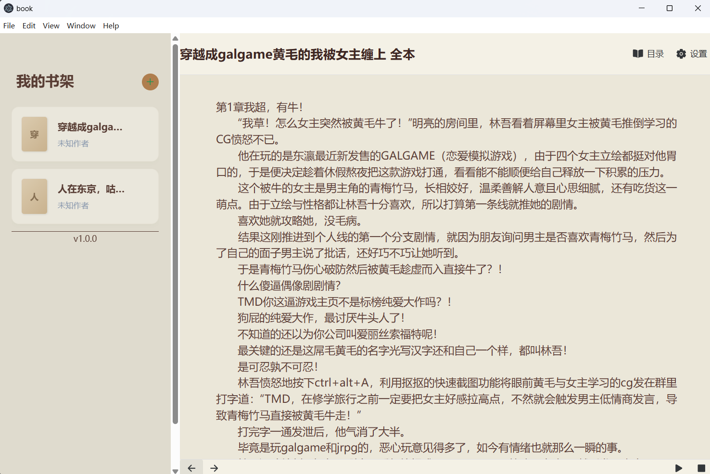

# Book Reader

一个轻量级的桌面小说阅读器，基于 Electron + Vue3 + Vite + Tailwind CSS 开发。

## 版本号

2.0.0

## TODO

- **听书**：集成本地VITS语音合成
- **格式支持**：扩展多种格式（如EPUB、PDF等）
- **UI优化**：进一步提升用户界面美观度和交互体验
- ~~**阅读进度保存**：自动保存阅读进度~~

## 展示图




## 功能特点

- **本地 TXT 导入**：支持导入本地 TXT 文件到应用中
- **智能章节解析**：自动解析 TXT 文件中的章节结构
- **文本朗读**：基于 Web Speech API 实现文本到语音的功能
- **主题切换**：支持多种主题模式，包括白色、羊皮纸、绿色和深色
- **阅读进度保存**：自动保存阅读进度，下次打开时从上次阅读的位置继续
- **书架管理**：支持添加、删除书籍，自动检测库目录中的书籍

## 技术栈

- **前端**：Vue3 + Vite + Tailwind CSS
- **后端**：Electron
- **存储**：文件系统存储

## 安装说明

### 环境要求

- Node.js 14.0 或更高版本
- npm 6.0 或更高版本

### 安装步骤

1. 克隆仓库

```bash
git clone https://github.com/starsky1391/book-reader.git
cd book-reader
```

2. 安装依赖

```bash
npm install
```

3. 启动开发服务器

```bash
npm run dev
```

4. 启动 Electron 应用

```bash
npm run electron:start
```

## 使用方法

### 导入书籍

1. 点击左侧书架栏的「导入书籍」按钮
2. 选择本地的 TXT 文件
3. 等待文件导入完成，书籍会自动添加到书架中

### 阅读书籍

1. 点击左侧书架栏中的书籍
2. 右侧会显示书籍内容
3. 使用目录面板可以快速跳转到不同章节
4. 点击「听书」按钮可以开始朗读当前章节

### 调整设置

1. 点击左侧的「设置」按钮
2. 可以调整主题、字体大小、语速等设置
3. 设置会自动保存

## 项目结构

```
book-reader/
├── electron/           # Electron 主进程代码
│   ├── main.js         # 主进程入口文件
│   └── preload.js      # 预加载脚本
├── src/                # Vue 前端代码
│   ├── assets/         # 静态资源
│   ├── components/     # 组件
│   ├── services/       # 服务层
│   │   ├── FileService.js    # 文件服务
│   │   ├── StoreService.js   # 存储服务
│   │   └── TTSService.js     # 语音合成服务
│   ├── App.vue         # 主应用组件
│   ├── main.ts         # 前端入口文件
│   └── style.css       # 全局样式
├── public/             # 公共资源
├── dist-electron/      # 打包输出目录
├── package.json        # 项目配置文件
├── README.md           # 项目说明文件
├── run.bat             # 一键启动脚本
└── vite.config.js      # Vite 配置文件
```

## 许可证

MIT
